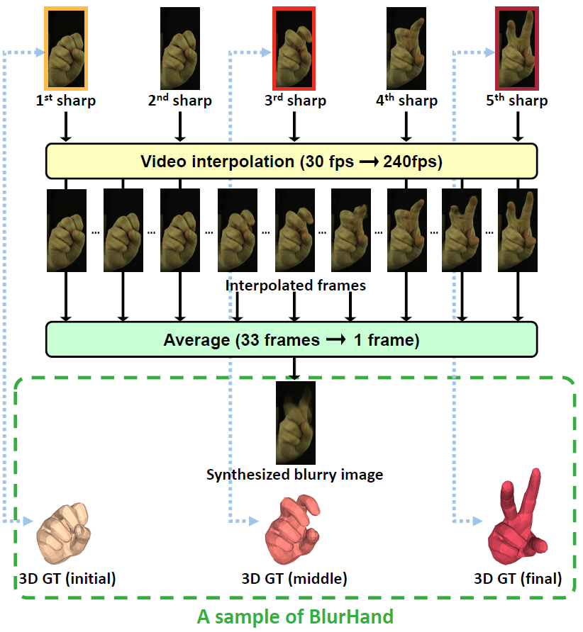

# BlurHand
You can download our BlurHand in [**here**](https://drive.google.com/drive/folders/178q3oUQrOIJMKi0KHoRoQmWRGM8JZnMi?usp=share_link).

Note that our BlurHand is synthesized from [**InterHand2.6M**](https://mks0601.github.io/InterHand2.6M/) 30 fps, and shares the same image `id`.

<!-- {: width="10" height="10"} -->
<div align="center">

</div>

### Directory

```
 ${ROOT}
 ├──blur_images
    ├──train
       └── Capture0 ~ Capture9
    └──test
       └── Capture0 ~ Capture1
      
 └──annotations
    ├──train
       ├──BlurHand_train_data.json
       ├──BlurHand_train_camera.json
       ├──BlurHand_train_joint_3d.json
       └──BlurHand_train_MANO_NeuralAnnot.json  
    └──test
       ├──BlurHand_test_data.json
       ├──BlurHand_test_camera.json
       ├──BlurHand_test_joint_3d.json
       └──BlurHand_test_MANO_NeuralAnnot.json  
```

### Annotation files

Our annotation files consist of four `.json` files.

For data loading, we recommend using [**Pycocotools**](https://pypi.org/project/pycocotools/). 

<!-- The usage example is [**here**](https://github.com/JaehaKim97/BlurHand_DEVELOP/blob/8c4c6d154340eefca51078b2330cd3552d06f5dd/src/data/BlurHand.py#L51). -->

The data format is heavily borrowed from [**InterHand2.6M**](https://mks0601.github.io/InterHand2.6M/).

```
BlurHand_SPLIT_data.json <dict>
 ├──'images'
    └──int (index) <dict>
       ├──'id': int (image id)
       ├──'file_name': str (image file name)
       ├──'width': int (image width)
       ├──'height': int (image height)
       ├──'capture': int (capture id)
       ├──'subject': int (subject id)
       ├──'seq_name': str (sequence name)
       ├──'camera': str (camera name)
       └──'frame_idx': int (frame index)
    
 └──'annotations'
    └──int (index) <dict>
       ├──'id': int (annotation id)
       ├──'bbox': list (bounding box coordinates. [xmin, ymin, width, height])
       ├──'joint_valid': list (can this annotaion be use for hand pose estimation training and evaluation? 1 if a joint is annotated and inside of image. 0 otherwise. this is based on 2D observation from the image.)
       ├──'hand_type': str (one of 'right', 'left', and 'interacting')
       ├──'hand_type_valid': int (can this annotation be used for handedness estimation training and evaluation? 1 if hand_type in ('right', 'left') or hand_type == 'interacting' and np.sum(joint_valid) > 30, 0 otherwise. this is based on 2D observation from the image.)
       ├──'aid_list': list[int] (annotation id for five sequential sharp images, which are used for synthesizing blurry hand image)
       └──'is_middle': bool (true if the image corresponds to the 3rd frame when synthesizing BlurHand)
```

```
BlurHand_SPLIT_camera.json <dict>
 └──str (capture id) <dict>
    ├──'campos' <dict>
       └──str (camera name): [x,y,z] (camera position)
    ├──'camrot' <dict>
       └──str (camera name): 3x3 list (camera rotation matrix)
    ├──'focal' <dict>
       └──str (camera name): [focal_x, focal_y] (focal length of x and y axis)
    └──'princpt' <dict>
       └──str (camera name): [princpt_x, princpt_y] (principal point of x and y axis)
```

```
BlurHand_SPLIT_joint_3d.json <dict>
 └──str (capture id) <dict>
    └──str (frame idx) <dict>
       ├──'world_coord': Jx3 list (3D joint coordinates in the world coordinate system. unit: milimeter.)
       ├──'joint_valid': Jx3 list (1 if a joint is successfully annotated 0 else. Unlike 'joint_valid' of InterHand2.6M_$DB_SPLIT_data.json, it does not consider whether it is truncated in the image space or not.)
       ├──'hand_type': str (one of 'right', 'left', and 'interacting'. taken from sequence names)
       └──'seq': str (sequence name)
```

```
BlurHand_SPLIT_MANO_NeuralAnnot.json <dict>
  └──str (capture id) <dict>
      └──str (frame idx) <dict>
        ├──'right' <dict>
          ├──'pose': 48 dimensional MANO pose vector in axis-angle representation minus the mean pose.
          ├──'shape': 10 dimensional MANO shape vector.
          └──'trans': 3 dimensional MANO translation vector in meter unit.
        └──'left' <dict>
          ├──'pose': 48 dimensional MANO pose vector in axis-angle representation minus the mean pose.
          ├──'shape': 10 dimensional MANO shape vector.
          └──'trans': 3 dimensional MANO translation vector in meter unit.

# The 3D MANO fits are obtained by NeuralAnnot (https://arxiv.org/abs/2011.11232).
# For the MANO mesh rendering, please see https://github.com/facebookresearch/InterHand2.6M/blob/master/MANO_render/render.py
```

<div align="right">
 <a href="../../README.md" style="float: right;">Link</a> to return main document.
</div>
